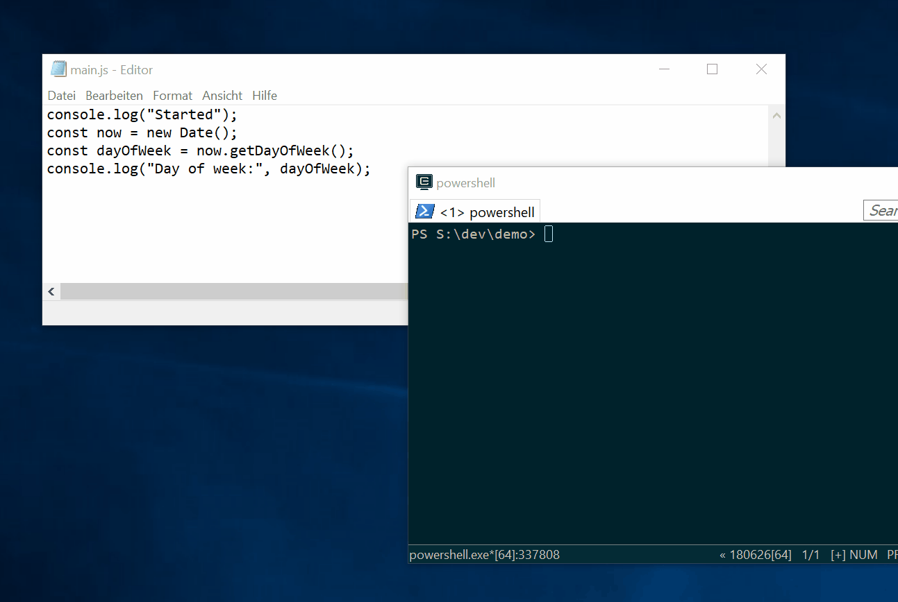
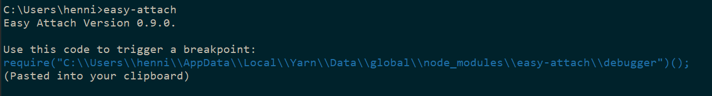
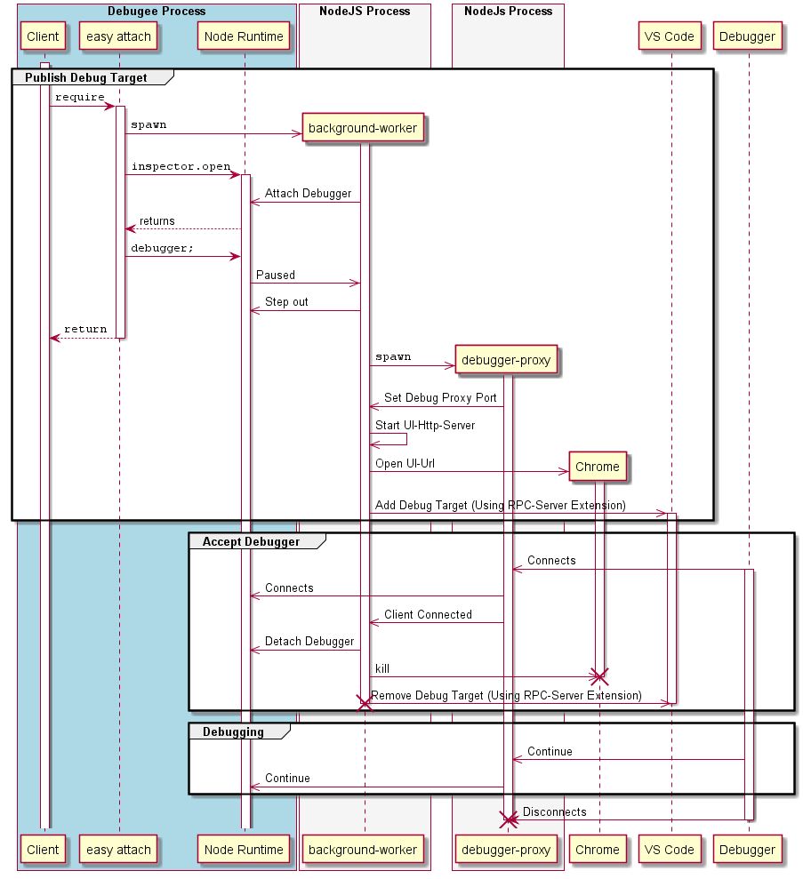

# Easy Attach

A helper tool that makes launching the debugger to step through obscure node-js scripts (e.g. webpack configurations) extremely easy.

Like `Debugger.Break()` from C#. Everything the `debugger;` statement should be.

## Why `debugger;` doesn't do it
`debugger;` does nothing if no debugger is attached.

This means you have to either launch the process in debug mode from the start (which is complicated if you don't control how the process is launched) or be quick to attach it before the line you want to break at is executed.

With this project you can just paste one line and it will launch a debugger of your choice (VSCode or Chrome) while suspending the running process, regardless of how it was started.

## Requirements

-   You need Chrome or VS Code with [the RPC Server extension](https://marketplace.visualstudio.com/items?itemName=hediet.vscode-rpc-server) to be installed.

Developed on Windows, tested on Windows and Linux.

## Installation

`easy-attach` should best be installed globally:

```
yarn global add easy-attach
```

Or if you use npm:

```
npm install --global easy-attach
```

## Demo



## Usage

Run `easy-attach` to see instructions:



Then, in the script you want to debug, insert the code from the instructions:

```js
function obscureFunction(args) {
	// this require call launches the debugger and waits
	require("C:\\Users\\henni\\AppData\\Local\\Yarn\\Data\\global\\node_modules\\easy-attach\\debugger")();
	anotherObscureFunction(args.data);
}
```

When the `require("[...]\\debugger")()` is called, a chrome window is launched with further instructions.
By pasting the displayed link into chrome you can debug your node js application!
This even works in node repl!

You can also pass a label to the call so that you don't mix up various breakpoints:

```js
require("...\\easy-attach\\debugger")({ label: "Server" });
```

If you don't want the debugger to halt, you can pass a `continue` flag:

```js
require("...\\easy-attach\\debugger")({ continue: true });
```

## Design Notes

This sequence diagram roughly describes what is going on:



### background-worker

The background-worker process is required as we don't want to return from the `require` call before a debugger successfully attached, otherwise we would miss the `debugger;` breakpoint.
Thus, we cannot use the event loop of the debugee and have to spawn a new process and wait for it to exit synchronously.

### debugger-proxy

The debugger-proxy is used to inform the background-worker that a debugger has attached.
There seems to be no other way.
Care has to be taken that is exits neither too early nor never.

## Used Dependencies

Utility functions:

-   [@hediet/std](https://www.npmjs.com/package/@hediet/std)

For typed communicating between background-worker and debugger-proxy:

-   [@hediet/typed-json-rpc](https://www.npmjs.com/package/@hediet/typed-json-rpc)
-   [@hediet/typed-json-rpc-streams](https://www.npmjs.com/package/@hediet/typed-json-rpc-streams)

For proxying node debug:

-   [http-proxy](https://www.npmjs.com/package/http-proxy)
-   [@types/http-proxy](https://www.npmjs.com/package/@types/http-proxy)
-   [simples](https://www.npmjs.com/package/simples)

For the CLI:

-   [chalk](https://www.npmjs.com/package/chalk)
-   [clipboardy](https://www.npmjs.com/package/clipboardy)

To get the chrome debug url and launch chrome:

-   [node-fetch](https://www.npmjs.com/package/node-fetch)
-   [chrome-launcher](https://www.npmjs.com/package/chrome-launcher)

To notify vscode:

-   [vscode-rpc](https://www.npmjs.com/package/vscode-rpc)

To find free ports:

-   [get-port](https://www.npmjs.com/package/get-port)

## Known Problems

-   Sometimes, when launchend, the background-worker appears for a short moment as black terminal window. I don't know why.
